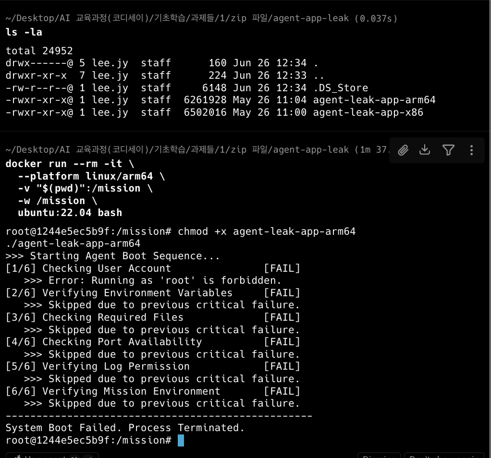
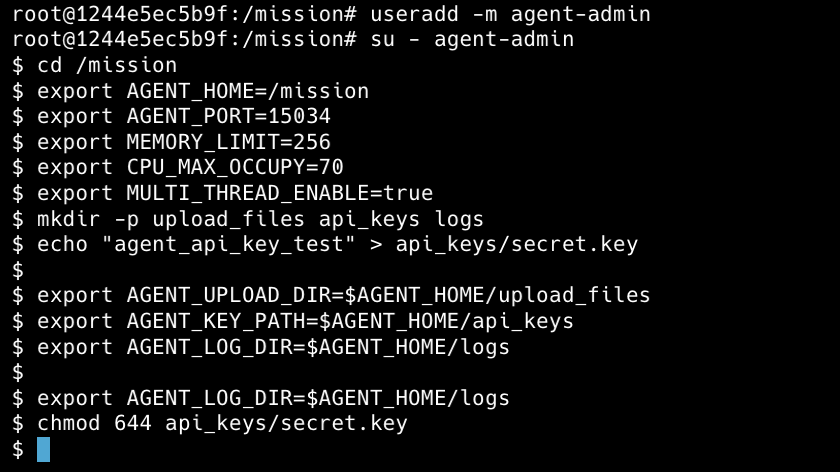
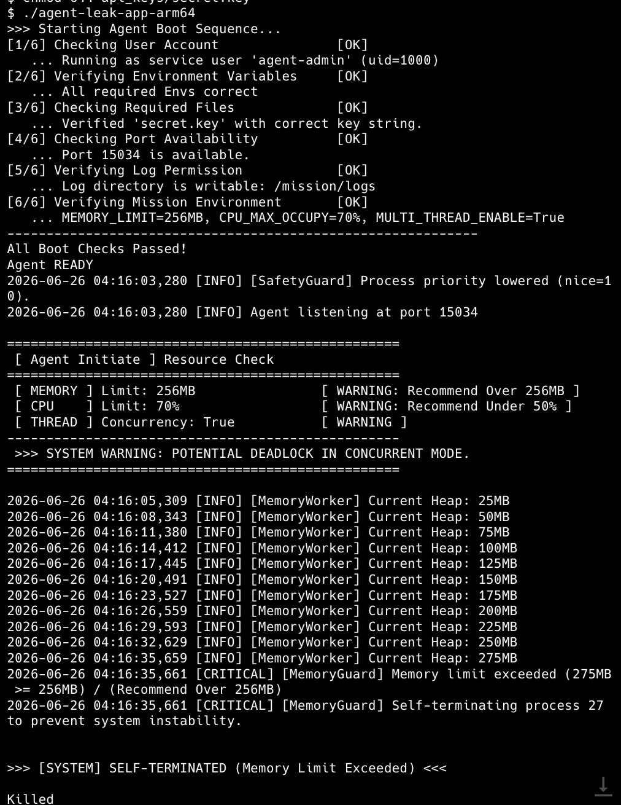
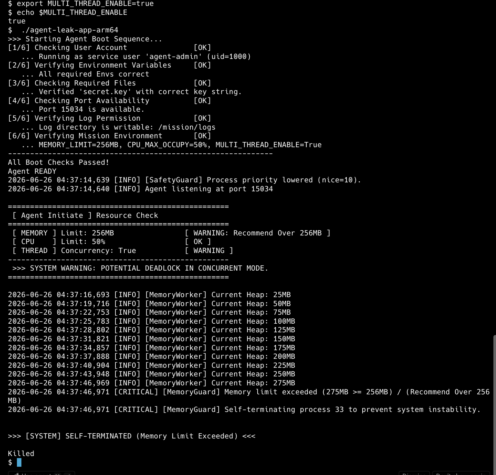
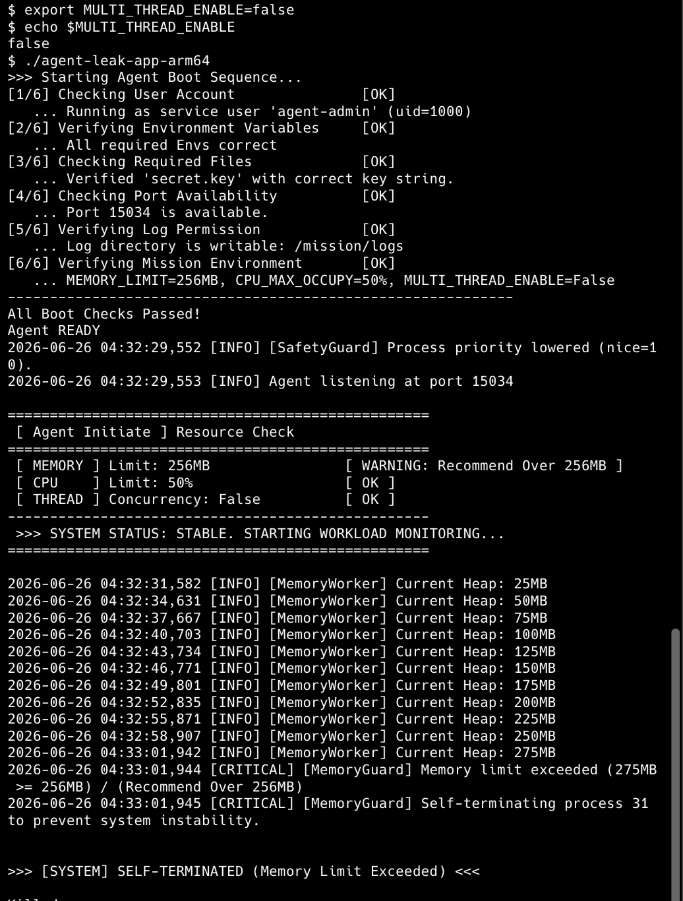
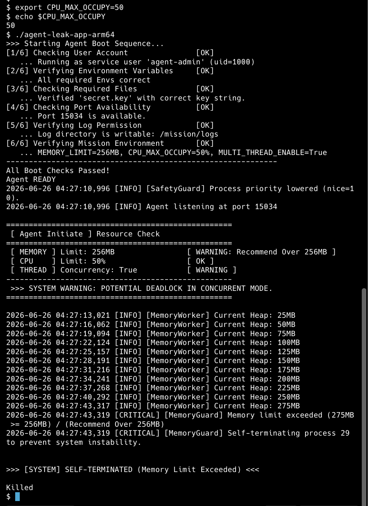

<!-- @format -->

# AI SW Basic - Agent Leak App Failure Report

## 1. 개발 환경 및 목적

- OS : macOS (Apple Silicon M3)
- Runtime : Docker Ubuntu 22.04
- Architecture : linux/arm64

특정 명령어를 외우게 하는 것이 나니라 실무형 자애 분석 및 협업 역량을 기른것을 목적이라고 생각합니다.

# 2. Boot Sequence

Root 계정에서는 프로그램 실행이 거부되었으며 일반 사용자(agent-admin)로 실행 후 Boot Sequence를 모두 통과하였다.




# 3. OOM (Out Of Memory)

## 현상

Heap Memory가 25MB부터 275MB까지 선형적으로 증가한 뒤 MemoryGuard에 의해 프로세스가 종료되었다.

```
Current Heap

25MB
50MB
...
275MB

[CRITICAL] Memory limit exceeded
SELF-TERMINATED
```



## 원인

MEMORY_LIMIT=256MB로 설정되어 있었으며 Heap Memory가 제한값을 초과하여 MemoryGuard가 프로세스를 강제 종료하였다.

## 조치

```bash
export MEMORY_LIMIT=512
```

또는

```bash
export MEMORY_LIMIT=1024
```

으로 변경하여 더 많은 메모리를 사용할 수 있도록 설정하였다.

※ 이번 실습에서는 환경변수 변경을 수행하였으나 증가된 생존 시간을 정량적으로 비교하지는 않았다.

# 4. CPU Spike

## 현상

초기 설정은 다음과 같았다.

```
CPU_MAX_OCCUPY=70%
```

실행 결과

```
WARNING
Recommend Under 50%
```



## 원인

CPU 사용 제한값이 권장 기준보다 높게 설정되어 있었다.

## 조치

```bash
export CPU_MAX_OCCUPY=50
```

변경 후

```
CPU Limit : 50%
OK
```

를 확인하였다.

📸 **이미지 삽입 : 05_CPU_After.png**

CPU 제한을 낮추면 특정 프로세스가 CPU를 과점유하는 것을 방지하여 다른 서비스의 응답성을 유지할 수 있다.

# 5. Potential Deadlock

## 현상

```
MULTI_THREAD_ENABLE=True
```

상태에서

```
SYSTEM WARNING
POTENTIAL DEADLOCK IN CONCURRENT MODE
```

가 출력되었다.



## 원인

멀티스레드 환경에서는 공유 자원에 대해 **상호 배제(Mutual Exclusion)** 가 발생한다. 두 스레드가 서로가 가진 Lock을 기다리는 **순환 대기(Circular Wait)** 상태가 되면 Deadlock이 발생할 수 있다.

## 조치

```bash
export MULTI_THREAD_ENABLE=false
```

변경 후

```
THREAD Concurrency : False

SYSTEM STATUS : STABLE
```

를 확인하였다.




# 6. monitor.sh 분석

monitor.sh는 아래 명령어를 이용하여 시스템 상태를 확인하였다.

| 항목    | 명령어      | 목적                                              |
| ------- | ----------- | ------------------------------------------------- |
| Process | `ps`        | 프로세스 실행 여부 확인                           |
| CPU     | `top -bn1`  | CPU 사용률 확인 (`-b`: 배치모드, `-n1`: 1회 실행) |
| Memory  | `free`      | 메모리 사용량 확인                                |
| Disk    | `df`        | 디스크 사용률 확인                                |
| Port    | `ss -tulnp` | 서비스 포트 확인                                  |

수집한 정보를 monitor.log에 기록하도록 구성하였다.

# 7. 운영 환경 개선

- Heap 사용률이 80%를 초과하면 Warning을 발생시키도록 monitor.sh 개선
- CPU 사용률이 일정 시간 이상 지속되면 Alert 및 자동 Restart 기능 추가
- Deadlock 발생 시 Thread Dump를 저장하고 Watchdog을 이용하여 자동 감지하도록 개선

# 8. 회고

이번 실습을 통해 OOM, CPU Spike, Deadlock을 각각 재현하고 환경변수를 이용하여 동작 변화를 확인하였다.

다시 수행한다면 **장애를 먼저 재현한 후 PID, Timestamp, monitor.log를 함께 수집하여 Before / After를 정량적으로 비교**하는 방식으로 트러블슈팅을 진행할 것이다.
