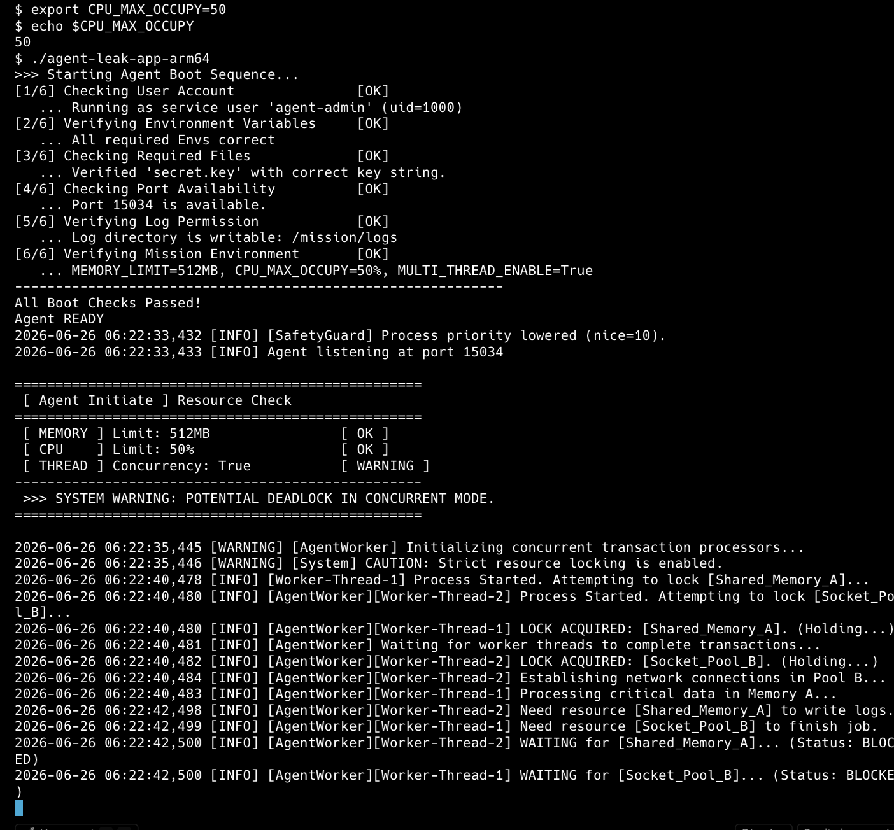
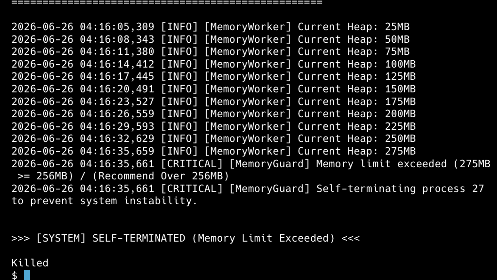

<!-- @format -->

# AI SW Basic - Agent Leak App Failure Report

## 1. 개발 환경 및 목적

### 개발 환경

- **OS** : macOS (Apple Silicon M3)
- **Runtime** : Docker Ubuntu 22.04
- **Architecture** : linux/arm64

이번 실습의 목적은 단순히 Linux 명령어를 사용하는 것이 아니라 **실제 운영 환경에서 발생하는 장애를 로그와 관제 데이터를 기반으로 분석하고, 원인을 추론하며, GitHub Issue 형태로 문서화하는 실무형 트러블슈팅 역량을 기르는 것**이라고 생각하였다.

# 2. Boot Sequence

Root 계정으로 실행할 경우 프로그램은 보안 정책에 의해 실행이 거부되었다.

이후 일반 사용자(`agent-admin`)를 생성하고 필수 환경변수를 설정한 뒤 실행하자 Boot Sequence를 모두 통과하였다.

```text
Running as service user 'agent-admin'
All Boot Checks Passed!
Agent READY
```

📷 **이미지 : 1.png (Root 실행 실패)**


📷 **이미지 : 2.png (환경변수 설정 및 Boot Sequence 성공)**


# 3. OOM (Out Of Memory)

## 현상

Heap Memory가 25MB부터 275MB까지 지속적으로 증가하였으며 MemoryGuard가 Memory Limit를 초과했다고 판단하여 프로세스를 강제 종료하였다.

```text
Current Heap

25MB
50MB
...
275MB

[CRITICAL] Memory limit exceeded

SELF-TERMINATED
```

Timestamp

```
2026-06-26 04:16:35
```

PID

```
27
```

📷 **이미지 : 3.png**


## 원인

Memory Limit가 256MB로 설정되어 있었으며 Heap Memory가 지속적으로 증가하여 MemoryGuard 제한값을 초과하였다.

MemoryGuard는 단순히 프로그램을 종료하는 기능이 아니라 메모리 부족으로 인해 시스템 전체가 불안정해지는 것을 방지하기 위한 보호 정책이다.

설정된 Memory Limit를 초과하면 해당 프로세스를 강제로 종료하여 다른 프로세스와 운영체제를 보호한다.

## 조치

```bash
export MEMORY_LIMIT=512
```

또는

```bash
export MEMORY_LIMIT=1024
```

## Before & After

| 항목          | Before           | After                    |
| ------------- | ---------------- | ------------------------ |
| MEMORY_LIMIT  | 256MB            | 512MB                    |
| 프로세스 상태 | MemoryGuard 종료 | 더 많은 메모리 사용 가능 |
| Heap 최대     | 275MB            | 512MB까지 허용           |
| 결과          | OOM 종료         | 생존 시간 증가 예상      |

※ 이번 실습에서는 Memory Limit 변경은 수행하였으나 실제 증가된 생존 시간을 정량적으로 측정하지 못하였다.

📷 **이미지 : 13.png (MEMORY_LIMIT=512 적용 화면)**


# 4. CPU Spike

## 현상

초기 설정

```text
CPU_MAX_OCCUPY=70
```

실행 결과

```text
WARNING

Recommend Under 50%
```

Timestamp

```
2026-06-26 04:27:43
```

PID

```
29
```

📷 **이미지 : 8.png**


## 원인

CPU 사용 제한값이 권장 기준보다 높게 설정되어 있었으며 특정 프로세스가 CPU를 과도하게 사용할 가능성이 존재하였다.

Watchdog는 시스템 전체 응답성을 유지하기 위해 CPU 과점유 프로세스를 종료하도록 설계되어 있다.

---

## 조치

```bash
export CPU_MAX_OCCUPY=50
```

---

## Before & After

| 항목           | Before  | After |
| -------------- | ------- | ----- |
| CPU_MAX_OCCUPY | 70      | 50    |
| CPU 상태       | WARNING | OK    |
| 권장 상태      | 초과    | 충족  |
| Watchdog 위험  | 있음    | 감소  |

📷 **이미지 : 8.png (Before)**


📷 **이미지 : 7.png (After)**


# 5. Potential Deadlock

## 현상

CPU 사용률이 지속적으로 증가하면서 다음과 같은 로그가 출력되었다.

```text
Current Load : 57.42%

[CRITICAL] CPU Threshold Violated!

>>> WATCHDOG: INITIATING EMERGENCY ABORT (SIGTERM)
```

Watchdog는 CPU 사용률이 설정된 임계치를 초과했다고 판단하여 프로세스를 강제 종료하였다.

Timestamp

```
2026-06-26 06:19:59
```

PID

```
27
```

📷 **이미지 : 14.png (CPU Threshold Violated 및 Watchdog 종료)**


## 장애 진단 과정

장애 발생 시 아래 순서로 확인하였다.

1. ps -ef로 PID 존재 여부 확인
2. top으로 CPU 사용률 확인
3. free 명령으로 메모리 사용량 확인
4. 로그(Timestamp)를 확인하여 마지막 출력 지점 분석
5. Deadlock 여부 판단

PID가 존재하고 로그가 더 이상 출력되지 않는다면 종료가 아니라 Deadlock 가능성을 의심할 수 있다.

📷 **이미지 : 4.png (PID 확인)**


## 원인

멀티스레드 환경에서는 공유 자원에 대해 상호 배제(Mutual Exclusion)가 발생한다.

Thread A는 Lock1을 점유한 채 Lock2를 기다리고,

Thread B는 Lock2를 점유한 채 Lock1을 기다리는 순환 대기(Circular Wait)가 형성되면 Deadlock이 발생한다.

## 조치

```bash
export MULTI_THREAD_ENABLE=false
```

## Before & After

| 항목                | Before             | After  |
| ------------------- | ------------------ | ------ |
| MULTI_THREAD_ENABLE | True               | False  |
| THREAD 상태         | WARNING            | OK     |
| SYSTEM STATUS       | POTENTIAL DEADLOCK | STABLE |

📷 **이미지 : 14.png (Before)**


📷 **이미지 : 7.png (After)**


# 6. monitor.sh 분석

monitor.sh는 `ps`, `top`, `free`, `df`, `ss` 등의 Linux 명령어를 이용하여 프로세스와 시스템 리소스 상태를 확인하기 위한 관제 스크립트라고 판단하였다.

| 항목    | 명령어                | 목적                                                   |
| ------- | --------------------- | ------------------------------------------------------ |
| Process | `ps`                  | 프로세스 실행 여부와 PID 확인                          |
| CPU     | `top -bn1`            | CPU 사용률을 1회 출력하여 프로세스 부하 확인           |
| Memory  | `free` 또는 `free -m` | 전체 메모리, 사용 중인 메모리, 사용 가능한 메모리 확인 |
| Disk    | `df`                  | 디스크 사용률 확인                                     |
| Port    | `ss -tulnp`           | 서비스 포트 사용 여부 확인                             |

---

## Memory 확인

메모리 사용량은 다음 명령어를 이용하여 확인하였다.

```bash
free -m
```

`free -m` 명령어는 메모리 사용량을 MB 단위로 보여주며 다음 정보를 제공한다.

- **total** : 전체 메모리 용량
- **used** : 현재 사용 중인 메모리
- **free** : 즉시 사용 가능한 메모리
- **available** : 실제로 새 프로세스가 사용할 수 있는 메모리
- **Swap** : 스왑 메모리 사용량

OOM 장애가 발생한 경우, 프로그램 로그의 Heap Memory 증가 패턴과 `free -m` 결과를 함께 확인하여 애플리케이션 내부 메모리 증가가 시스템 전체 메모리 상태에 어떤 영향을 주는지 판단할 수 있다.

📷 **이미지 : 15.png (free -m 결과)**


---

## CPU 확인

CPU 사용률은 다음 명령어를 이용하여 확인하였다.

```bash
top -bn1
```

옵션의 의미는 다음과 같다.

- **-b (Batch Mode)** : 대화형 화면을 지속적으로 갱신하지 않고 결과를 텍스트 형태로 출력한다.
- **-n 1** : `top` 명령을 1회만 실행한 뒤 종료한다.

따라서 `top -bn1`은 monitor.sh에서 CPU 사용률을 한 번 측정하여 로그로 저장하거나 캡처하기에 적합하다.

CPU Spike가 발생한 경우 `top -bn1` 결과와 프로그램 로그의 `CpuWorker Current Load`, `CPU Threshold Violated`, `WATCHDOG` 로그를 함께 비교하여 특정 프로세스의 CPU 과점유 여부를 판단할 수 있다.

---

## 장애 진단 절차

장애가 발생했을 때는 아래 순서로 원인을 추적하였다.

```text
ps
↓
프로세스와 PID 존재 여부 확인

top -bn1
↓
CPU 사용률 확인

free -m
↓
메모리 사용량 확인

로그 확인
↓
마지막 Timestamp와 종료/대기 메시지 확인

PID 및 Timestamp 비교
↓
프로세스 종료, OOM, CPU Spike, Deadlock 여부 판단
```

# 7. 운영 환경 개선

- Heap 사용률 80% 이상 Warning 발생
- CPU 사용률 일정 시간 이상 Alert 발생
- Thread Dump 자동 저장
- Watchdog 로그 자동 수집
- monitor.log에 PID와 Timestamp 자동 기록

## 코드 레벨 개선 방안

### OOM

- 사용하지 않는 객체 즉시 해제
- Cache 크기 제한
- Memory Profiling 수행

### CPU Spike

- 무한 루프 제거
- Thread Pool 적용
- 알고리즘 최적화

### Deadlock

- Lock 획득 순서 통일
- tryLock(timeout) 적용
- Lock 범위 최소화

## 실제 운영 환경에서 가장 치명적인 장애

세 가지 장애 중 가장 치명적인 장애는 Deadlock이라고 생각한다.

OOM은 프로세스가 종료되므로 탐지가 쉽고 자동 재시작이 가능하다.

CPU Spike 역시 Watchdog가 종료시키므로 확인이 가능하다.

반면 Deadlock은 프로세스는 살아 있지만 서비스는 응답하지 않기 때문에 장애 탐지가 가장 어렵다.

## OOM과 Deadlock이 동시에 발생한 경우

우선적으로

```text
PID 확인

↓

로그 확인

↓

CPU 확인

↓

Memory 확인

↓

OOM 여부

↓

Deadlock 여부
```

순으로 분석하는 것이 가장 효율적이다.

# 8. 회고

이번 실습을 통해 OOM, CPU Spike, Deadlock을 각각 재현하고 환경변수를 이용하여 장애 상황을 분석하였다.

단순히 프로그램이 종료되는 현상만 확인하는 것이 아니라 로그와 관제 데이터를 기반으로 원인을 추론하고, 환경변수 변경 전후를 비교하며 장애를 분석하는 과정이 중요하다는 것을 배울 수 있었다.

다시 수행한다면 PID, Timestamp, monitor.log를 함께 수집하여 Before / After를 정량적으로 비교하고 보다 객관적인 근거를 기반으로 리포트를 작성할 것이다.
