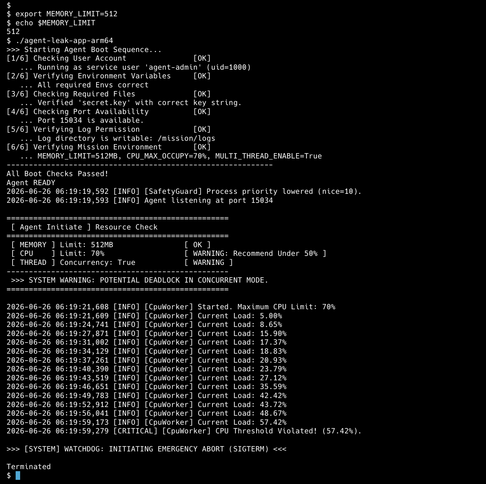
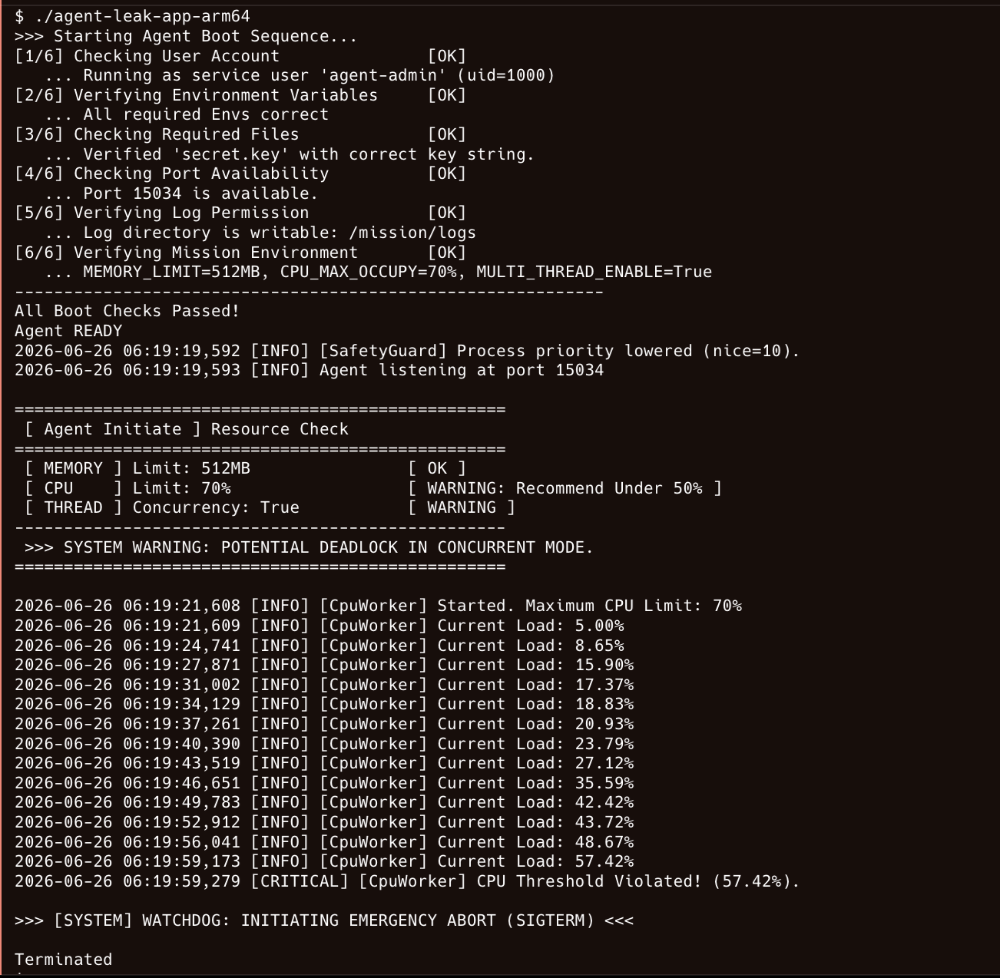
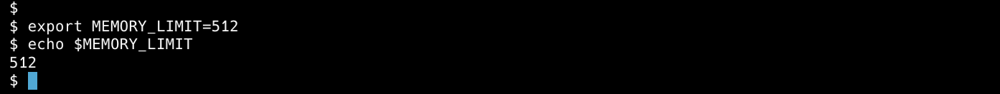
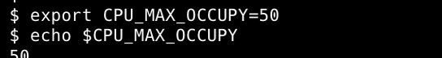
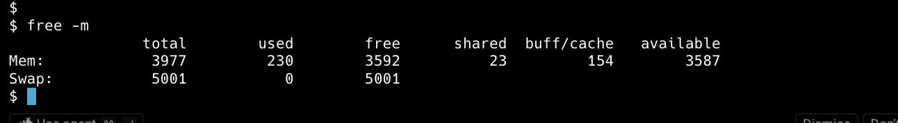

<!-- @format -->

# AI SW Basic - Agent Leak App Failure Report

## 1. 개발 환경 및 목적

### 개발 환경

- **OS** : macOS (Apple Silicon M3)
- **Runtime** : Docker Ubuntu 22.04
- **Architecture** : linux/arm64

이번 실습의 목적은 단순히 Linux 명령어를 사용하는 것이 아니라 **실제 운영 환경에서 발생하는 장애를 로그와 관제 데이터를 기반으로 분석하고, 원인을 추론하며, GitHub Issue 형태로 문서화하는 실무형 트러블슈팅 역량을 기르는 것**이라고 생각하였다.

# 2. Boot Sequence

Root 계정으로 실행할 경우 프로그램은 보안 정책에 의해 실행이 거부되었다.

이후 일반 사용자(`agent-admin`)를 생성하고 필수 환경변수를 설정한 뒤 실행하자 Boot Sequence를 모두 통과하였다.

```text
Running as service user 'agent-admin'
All Boot Checks Passed!
Agent READY
```

📷 **이미지 : 1.png (Root 실행 실패)**


📷 **이미지 : 2.png (환경변수 설정 및 Boot Sequence 성공)**


# 3. OOM (Out Of Memory)

## 현상

Heap Memory가 25MB부터 275MB까지 지속적으로 증가하였으며 MemoryGuard가 Memory Limit를 초과했다고 판단하여 프로세스를 강제 종료하였다.

```text
2026-06-26 04:16:05,309 [INFO] [MemoryWorker] Current Heap: 25MB
2026-06-26 04:16:08,343 [INFO] [MemoryWorker] Current Heap: 50MB
...
2026-06-26 04:16:35,659 [INFO] [MemoryWorker] Current Heap: 275MB
2026-06-26 04:16:35,661 [CRITICAL] [MemoryGuard] Memory limit exceeded (275MB >= 256MB)
2026-06-26 04:16:35,661 [CRITICAL] [MemoryGuard] Self-terminating process 27
>>> [SYSTEM] SELF-TERMINATED (Memory Limit Exceeded) <<<
```

Timestamp

📷 **이미지 : 3.png**


## 원인

Memory Limit가 256MB로 설정되어 있었으며 Heap Memory가 지속적으로 증가하여 MemoryGuard 제한값을 초과하였다.

MemoryGuard는 단순히 프로그램을 종료하는 기능이 아니라 메모리 부족으로 인해 시스템 전체가 불안정해지는 것을 방지하기 위한 보호 정책이다.

설정된 Memory Limit를 초과하면 해당 프로세스를 강제로 종료하여 다른 프로세스와 운영체제를 보호한다.

## 조치

```bash
export MEMORY_LIMIT=512
```

## Before & After

| 항목          | Before           | After                    |
| ------------- | ---------------- | ------------------------ |
| MEMORY_LIMIT  | 256MB            | 512MB                    |
| 프로세스 상태 | MemoryGuard 종료 | 더 많은 메모리 사용 가능 |
| Heap 최대     | 275MB            | 512MB까지 허용           |
| 결과          | OOM 종료         | 생존 시간 증가 예상      |

MEMORY_LIMIT=256MB에서는 Heap이 275MB에 도달한 뒤 06:16:40에 MemoryGuard로 종료되었다.

MEMORY_LIMIT=512MB에서는 Boot Sequence에서 MEMORY_LIMIT=512MB가 적용되었고, 275MB에서 MemoryGuard 종료가 발생하지 않았다. 이후 CPU 부하가 먼저 증가하여 06:19:59에 Watchdog(SIGTERM)에 의해 종료되었다.

따라서 MEMORY_LIMIT 조정 후 OOM 종료 시점은 지연되었고, 장애 유형이 MemoryGuard 종료에서 CPU Watchdog 종료로 변화하였다.

📷 **이미지 : 13.png (MEMORY_LIMIT=512 적용 화면)**


# 4. CPU Spike

## 현상

초기 설정은 다음과 같았다.

```text
CPU_MAX_OCCUPY=70
```

실행 결과 CPU 사용률이 지속적으로 증가하였다.

```text
2026-06-26 06:19:21,609 [INFO] [CpuWorker] Current Load: 5.00%
2026-06-26 06:19:24,741 [INFO] [CpuWorker] Current Load: 8.65%
2026-06-26 06:19:27,871 [INFO] [CpuWorker] Current Load: 15.90%
2026-06-26 06:19:31,002 [INFO] [CpuWorker] Current Load: 17.37%
2026-06-26 06:19:34,129 [INFO] [CpuWorker] Current Load: 18.83%
2026-06-26 06:19:37,261 [INFO] [CpuWorker] Current Load: 20.93%
2026-06-26 06:19:40,390 [INFO] [CpuWorker] Current Load: 23.79%
2026-06-26 06:19:43,519 [INFO] [CpuWorker] Current Load: 27.12%
2026-06-26 06:19:46,651 [INFO] [CpuWorker] Current Load: 35.59%
2026-06-26 06:19:49,783 [INFO] [CpuWorker] Current Load: 42.42%
2026-06-26 06:19:52,912 [INFO] [CpuWorker] Current Load: 43.72%
2026-06-26 06:19:56,041 [INFO] [CpuWorker] Current Load: 48.67%
2026-06-26 06:19:59,173 [INFO] [CpuWorker] Current Load: 57.42%
2026-06-26 06:19:59,279 [CRITICAL] [CpuWorker] CPU Threshold Violated! (57.42%).
>>> [SYSTEM] WATCHDOG: INITIATING EMERGENCY ABORT (SIGTERM) <<<
```

CPU 사용률이 57.42%까지 증가한 뒤 임계치를 초과하였고, Watchdog가 시스템 보호를 위해 SIGTERM을 발생시켜 프로세스를 종료하였다.

Timestamp

```text
2026-06-26 06:19:59
```

📷 **이미지 : 14-1.png (CPU Threshold Violated 및 Watchdog 종료)**


---

## 원인

CPU 사용 제한값이 권장 기준보다 높게 설정되어 있었으며, CpuWorker가 실행되면서 특정 프로세스가 CPU를 지속적으로 점유하였다.

Watchdog는 시스템 전체 응답성을 유지하기 위해 CPU 사용률이 임계치를 초과한 프로세스를 종료하도록 설계되어 있다.

---

## 조치

```bash
export CPU_MAX_OCCUPY=50
```

---

## Before & After

| 항목           | Before                           | After                               |
| -------------- | -------------------------------- | ----------------------------------- |
| CPU_MAX_OCCUPY | 70                               | 50                                  |
| CPU 상태       | WARNING                          | OK                                  |
| 프로세스 종료  | WATCHDOG에 의해 SIGTERM 종료     | 초기 Resource Check에서 CPU OK 확인 |
| 핵심 로그      | CPU Threshold Violated, WATCHDOG | CPU Limit : 50%, OK                 |

CPU_MAX_OCCUPY=70 상태에서는 CPU 사용률이 57.42%까지 증가한 뒤 Watchdog에 의해 프로세스가 종료되었다.

CPU_MAX_OCCUPY=50으로 변경한 뒤에는 Resource Check에서 CPU 상태가 OK로 표시되어 권장 설정을 충족하는 것을 확인하였다.

📷 **이미지 : 14-1.png (Before - CPU Watchdog 종료)**


📷 **이미지 : 7.png (After - CPU Limit 50%, OK)**


---

# 5. Potential Deadlock

## 현상

멀티스레드 환경에서 실행한 결과 다음과 같은 경고가 출력되었다.

```text
MULTI_THREAD_ENABLE=True

SYSTEM WARNING
POTENTIAL DEADLOCK IN CONCURRENT MODE
```

이후 Worker Thread들이 서로 다른 공유 자원을 점유한 상태에서 상대방이 가진 자원을 기다리는 로그가 출력되었고, 프로그램 진행이 멈춘 상태가 되었다.

```text
2026-06-26 06:22:40,480 [INFO] [AgentWorker][Worker-Thread-1] LOCK ACQUIRED: [Shared_Memory_A]. (Holding...)
2026-06-26 06:22:40,482 [INFO] [AgentWorker][Worker-Thread-2] LOCK ACQUIRED: [Socket_Pool_B]. (Holding...)
2026-06-26 06:22:42,498 [INFO] [AgentWorker][Worker-Thread-2] Need resource [Shared_Memory_A] to write logs.
2026-06-26 06:22:42,499 [INFO] [AgentWorker][Worker-Thread-1] Need resource [Socket_Pool_B] to finish job.
2026-06-26 06:22:42,500 [INFO] [AgentWorker][Worker-Thread-2] WAITING for [Shared_Memory_A]... (Status: BLOCKED)
2026-06-26 06:22:42,500 [INFO] [AgentWorker][Worker-Thread-1] WAITING for [Socket_Pool_B]... (Status: BLOCKED)
```

Timestamp

```text
2026-06-26 06:22:42
```

📷 **이미지 : 12.png 또는 Deadlock 로그 이미지**


---

## 장애 진단 과정

장애 발생 시 다음 순서로 확인하였다.

1. `ps -ef`로 프로세스와 PID 존재 여부 확인
2. `top -bn1`로 CPU 사용률 확인
3. `free -m`으로 메모리 사용량 확인
4. 로그의 마지막 Timestamp 확인
5. Worker Thread의 Lock 획득 및 대기 로그 분석

프로세스가 종료되지 않은 상태에서 로그가 `WAITING`, `BLOCKED` 이후 더 이상 진행되지 않았기 때문에 단순 종료가 아니라 Deadlock 가능성을 의심하였다.

📷 **이미지 : 5.png (PID 확인)**


---

## 원인

멀티스레드 환경에서는 공유 자원에 대해 상호 배제(Mutual Exclusion)가 발생한다.

로그 분석 결과 두 개의 Worker Thread가 서로 다른 Lock을 점유한 상태에서 상대방의 Lock을 기다리는 순환 의존 관계를 확인하였다.

```text
Worker-Thread-1
Shared_Memory_A Lock 획득
↓
Socket_Pool_B 필요
↓
Socket_Pool_B 대기

Worker-Thread-2
Socket_Pool_B Lock 획득
↓
Shared_Memory_A 필요
↓
Shared_Memory_A 대기
```

즉, `Worker-Thread-1`은 `Shared_Memory_A`를 가진 상태로 `Socket_Pool_B`를 기다리고, `Worker-Thread-2`는 `Socket_Pool_B`를 가진 상태로 `Shared_Memory_A`를 기다리고 있다.

이로 인해 `Worker-Thread-1 → Worker-Thread-2 → Worker-Thread-1` 형태의 순환 대기(Circular Wait)가 발생하였으므로 Deadlock으로 판단하였다.

---

## 조치

멀티스레드 동시 실행을 비활성화하여 공유 자원에 대한 동시 접근을 회피하였다.

```bash
export MULTI_THREAD_ENABLE=false
```

---

## Before & After

| 항목                | Before                     | After              |
| ------------------- | -------------------------- | ------------------ |
| MULTI_THREAD_ENABLE | True                       | False              |
| THREAD 상태         | WARNING                    | OK                 |
| SYSTEM STATUS       | POTENTIAL DEADLOCK         | STABLE             |
| 로그 상태           | WAITING / BLOCKED에서 멈춤 | STABLE 상태로 시작 |

MULTI_THREAD_ENABLE=True 상태에서는 두 Worker Thread가 서로 다른 자원을 점유한 채 상대방의 자원을 기다리는 `WAITING/BLOCKED` 상태가 발생하였다.

MULTI_THREAD_ENABLE=false로 변경한 뒤에는 Thread Concurrency가 False로 표시되었고, `SYSTEM STATUS : STABLE`이 출력되어 Deadlock 경고가 사라진 것을 확인하였다.

📷 **이미지 : 12.png (Before - Deadlock 로그)**


📷 **이미지 : 7.png (After - STABLE 상태)**


# 6. monitor.sh 분석

monitor.sh

```bash
#!/bin/bash

LOG_FILE="${AGENT_LOG_DIR:-/mission/logs}/monitor.log"
APP_NAME="${APP_NAME:-agent-leak-app-arm64}"
APP_PORT="${AGENT_PORT:-15034}"

NOW=$(date "+%Y-%m-%d %H:%M:%S")

mkdir -p "$(dirname "$LOG_FILE")"

PID=$(pgrep -f "$APP_NAME" | head -n 1)

echo "====== SYSTEM MONITOR RESULT ======"
echo "[HEALTH CHECK]"

if [ -z "$PID" ]; then
    echo "Checking process '$APP_NAME'... [FAIL]"
    echo "Reason: target process is not running."
    PROC_CPU="N/A"
    PROC_MEM="N/A"
else
    echo "Checking process '$APP_NAME'... [OK] (PID: $PID)"
    PROC_CPU=$(ps -p "$PID" -o %cpu= | awk '{print $1}')
    PROC_MEM=$(ps -p "$PID" -o %mem= | awk '{print $1}')
fi

if ss -tulnp | grep -q ":$APP_PORT"; then
    echo "Checking port $APP_PORT... [OK]"
else
    echo "Checking port $APP_PORT... [FAIL]"
fi

SYS_CPU=$(top -bn1 | grep "Cpu(s)" | awk '{print 100 - $8}')
SYS_MEM=$(free | awk '/Mem:/ {printf("%.1f", $3/$2 * 100)}')
DISK=$(df / | awk 'NR==2 {print $5}' | sed 's/%//')

echo "[SYSTEM RESOURCE]"
echo "CPU Usage : $SYS_CPU%"
echo "MEM Usage : $SYS_MEM%"
echo "DISK Used : $DISK%"

echo "[PROCESS RESOURCE]"
echo "Agent PID       : ${PID:-N/A}"
echo "Agent CPU Usage : $PROC_CPU%"
echo "Agent MEM Usage : $PROC_MEM%"

SYS_CPU_INT=$(printf "%.0f" "$SYS_CPU")
SYS_MEM_INT=$(printf "%.0f" "$SYS_MEM")

if [ "$SYS_CPU_INT" -gt 20 ]; then
    echo "[WARNING] System CPU threshold exceeded ($SYS_CPU% > 20%)"
fi

if [ "$SYS_MEM_INT" -gt 10 ]; then
    echo "[WARNING] System MEM threshold exceeded ($SYS_MEM% > 10%)"
fi

if [ "$DISK" -gt 80 ]; then
    echo "[WARNING] DISK threshold exceeded ($DISK% > 80%)"
fi

echo "[$NOW] PID:${PID:-N/A} SYS_CPU:$SYS_CPU% SYS_MEM:$SYS_MEM% PROC_CPU:$PROC_CPU% PROC_MEM:$PROC_MEM% DISK_USED:$DISK%" >> "$LOG_FILE"

echo "[INFO] Log appended: $LOG_FILE"
```

monitor.sh는 `ps`, `top`, `free`, `df`, `ss` 등의 Linux 명령어를 이용하여 프로세스와 시스템 리소스 상태를 확인하기 위한 관제 스크립트라고 판단하였다.

| 항목    | 명령어                | 목적                                                   |
| ------- | --------------------- | ------------------------------------------------------ |
| Process | `ps`                  | 프로세스 실행 여부와 PID 확인                          |
| CPU     | `top -bn1`            | CPU 사용률을 1회 출력하여 프로세스 부하 확인           |
| Memory  | `free` 또는 `free -m` | 전체 메모리, 사용 중인 메모리, 사용 가능한 메모리 확인 |
| Disk    | `df`                  | 디스크 사용률 확인                                     |
| Port    | `ss -tulnp`           | 서비스 포트 사용 여부 확인                             |

---

## Memory 확인

메모리 사용량은 다음 명령어를 이용하여 확인하였다.

```bash
free -m
```

`free -m` 명령어는 메모리 사용량을 MB 단위로 보여주며 다음 정보를 제공한다.

- **total** : 전체 메모리 용량
- **used** : 현재 사용 중인 메모리
- **free** : 즉시 사용 가능한 메모리
- **available** : 실제로 새 프로세스가 사용할 수 있는 메모리
- **Swap** : 스왑 메모리 사용량

OOM 장애가 발생한 경우, 프로그램 로그의 Heap Memory 증가 패턴과 `free -m` 결과를 함께 확인하여 애플리케이션 내부 메모리 증가가 시스템 전체 메모리 상태에 어떤 영향을 주는지 판단할 수 있다.

📷 **이미지 : 15.png (free -m 결과)**


---

## CPU 확인

CPU 사용률은 다음 명령어를 이용하여 확인하였다.

```bash
top -bn1
```

옵션의 의미는 다음과 같다.

- **-b (Batch Mode)** : 대화형 화면을 지속적으로 갱신하지 않고 결과를 텍스트 형태로 출력한다.
- **-n 1** : `top` 명령을 1회만 실행한 뒤 종료한다.

따라서 `top -bn1`은 monitor.sh에서 CPU 사용률을 한 번 측정하여 로그로 저장하거나 캡처하기에 적합하다.

CPU Spike가 발생한 경우 `top -bn1` 결과와 프로그램 로그의 `CpuWorker Current Load`, `CPU Threshold Violated`, `WATCHDOG` 로그를 함께 비교하여 특정 프로세스의 CPU 과점유 여부를 판단할 수 있다.

---

## 장애 진단 절차

장애가 발생했을 때는 아래 순서로 원인을 추적하였다.

```text
ps
↓
프로세스와 PID 존재 여부 확인

top -bn1
↓
CPU 사용률 확인

free -m
↓
메모리 사용량 확인

로그 확인
↓
마지막 Timestamp와 종료/대기 메시지 확인

PID 및 Timestamp 비교
↓
프로세스 종료, OOM, CPU Spike, Deadlock 여부 판단
```

# 7. 운영 환경 개선

- Heap 사용률 80% 이상 Warning 발생
- CPU 사용률 일정 시간 이상 Alert 발생
- Thread Dump 자동 저장
- Watchdog 로그 자동 수집
- monitor.log에 PID와 Timestamp 자동 기록

## 코드 레벨 개선 방안

### OOM

- 사용하지 않는 객체 즉시 해제
- Cache 크기 제한
- Memory Profiling 수행

### CPU Spike

- 무한 루프 제거
- Thread Pool 적용
- 알고리즘 최적화

### Deadlock

- Lock 획득 순서 통일
- tryLock(timeout) 적용
- Lock 범위 최소화

## 실제 운영 환경에서 가장 치명적인 장애

세 가지 장애 중 가장 치명적인 장애는 Deadlock이라고 생각한다.

OOM은 프로세스가 종료되므로 탐지가 쉽고 자동 재시작이 가능하다.

CPU Spike 역시 Watchdog가 종료시키므로 확인이 가능하다.

반면 Deadlock은 프로세스는 살아 있지만 서비스는 응답하지 않기 때문에 장애 탐지가 가장 어렵다.

## OOM과 Deadlock이 동시에 발생한 경우

우선적으로

```text
PID 확인

↓

로그 확인

↓

CPU 확인

↓

Memory 확인

↓

OOM 여부

↓

Deadlock 여부
```

순으로 분석하는 것이 가장 효율적이다.

# 8. 회고

이번 실습을 통해 OOM, CPU Spike, Deadlock을 각각 재현하고 환경변수를 이용하여 장애 상황을 분석하였다.

단순히 프로그램이 종료되는 현상만 확인하는 것이 아니라 로그와 관제 데이터를 기반으로 원인을 추론하고, 환경변수 변경 전후를 비교하며 장애를 분석하는 과정이 중요하다는 것을 배울 수 있었다.

다시 이번 미션을 수행한다면 단순히 프로그램이 종료되었다는 결과만 기록하는 것이 아니라, **PID, Timestamp, monitor.log를 함께 수집하여 장애 발생 전후의 변화를 보다 체계적으로 분석**할 것이다. 또한 `ps`, `top`, `free` 등의 Linux 명령어를 활용해 CPU 사용률, 메모리 사용량, 프로세스 상태를 동일한 시점 기준으로 기록하고, 이를 Before & After 형태로 정량적으로 비교하여 환경변수 변경에 따른 영향을 객관적으로 검증할 것이다.
